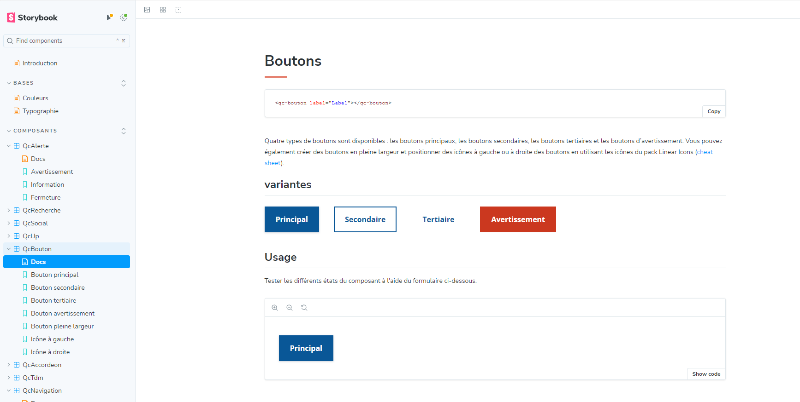

# Design System

Exemple [Storybook](https://storybook.js.org/) qui illustre l'intégration du système de design du gouvernement du Québec (non affilié) avec des composants Web standard en JavaScript vanille. Bien que cet exemple ne soit pas complet, il peut servir de point de départ pour vos projets.



Voir trousse officiel de développement du design système du gouverment avec Svelte [ici](https://design.quebec.ca/ressources/trousse-developpement).

## Démarrage

### Cloner le dépôt

Tout d'abord, clonez le dépôt depuis GitHub sur votre machine locale :

```bash
git clone https://github.com/bourpie/designsystem
```

### Installer les dépendances

Naviguez vers le répertoire du projet et installez les dépendances nécessaires en utilisant npm :

```bash
cd designsystem
npm install
```

### Démarrer Storybook

[Storybook](https://storybook.js.org/) est un environnement permettant de créer des composants et des pages d’interface utilisateur de manière isolée. On s'en sert pour le développement, les tests et la documentation de l’interface utilisateur. C’est open source et gratuit.

Pour démarrer Storybook et visualiser vos composants, utilisez la commande suivante :

```bash
npm run storybook
```

Cela lancera Storybook sur `http://localhost:6006` par défaut, où vous pourrez naviguer et tester vos composants dans un environnement isolé.

### Compiler la solution

Pour construire la solution pour la production, utilisez la commande suivante :

```bash
npm run build
```
Cette commande créera un dossier `dist` à la racine du projet. À l'intérieur, vous trouverez les fichiers JavaScript, les styles CSS, et les images optimisées prêtes à être intégrées dans votre projet.

### Démarrer l'environnement de développement (optionnel)

L'environnement de développement ([vite.js](https://vitejs.dev/)) permet de faire des tests d'intégration sur une page Web standard.Voir le fichier `index.html` (utilise le javascript et le css non compilés), et le fichier `exemple.html` (utilise le javascript et le css compilés du dossier `dist`) 

Pour démarrer l'environnement de développement, utilisez la commande suivante :

```bash
npm run dev
```


## Licence

Ce projet est sous licence MIT. Voir le fichier [LICENSE](./LICENSE.md) pour plus de détails.

## Auteur

[@bourpie](https://github.com/bourpie)
